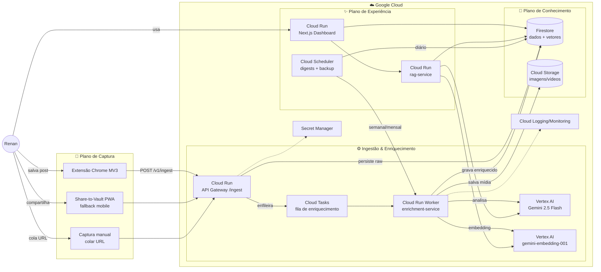
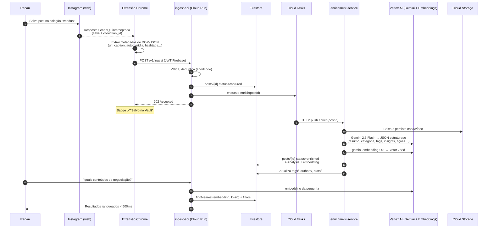
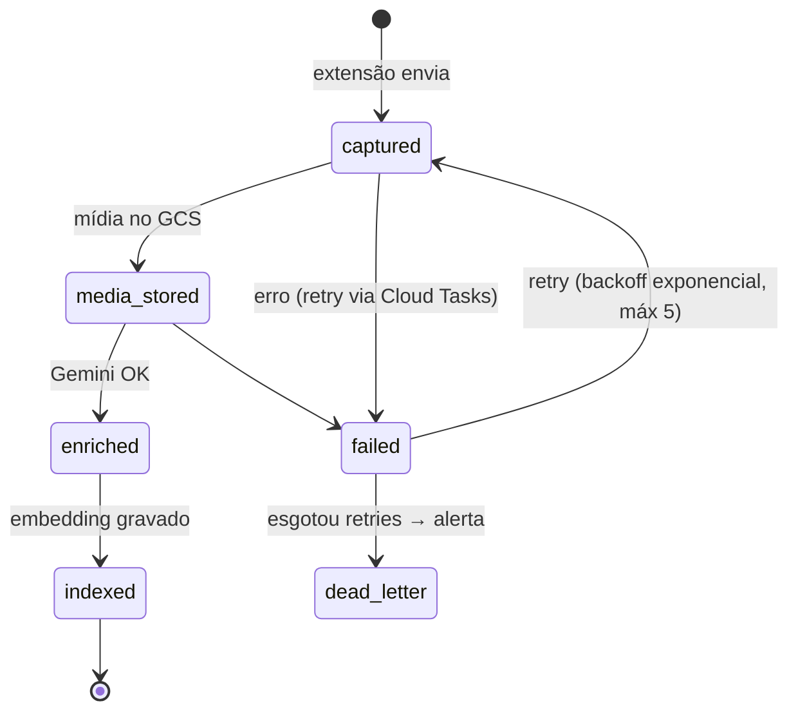
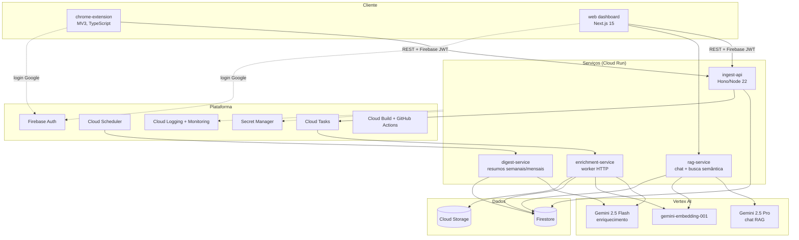

# 01 — Arquitetura do Sistema

## 1. Visão geral

O Renan Vault é composto por **4 planos** independentes, conectados por eventos assíncronos:

1. **Plano de Captura** — extensão Chrome (e fallbacks) que detecta posts salvos e os envia para a API de ingestão.
2. **Plano de Ingestão & Enriquecimento** — pipeline assíncrono que normaliza, armazena mídia, enriquece com Gemini e gera embeddings.
3. **Plano de Conhecimento** — Firestore (dados + vetores), Cloud Storage (mídia), índices de busca.
4. **Plano de Experiência** — dashboard Next.js (Home, Biblioteca, Conteúdo, IA/Chat, Analytics) + jobs agendados (resumo semanal/mensal, backup).

### Diagrama de alto nível

---

## 2. Fluxograma principal: do "salvar" ao "pesquisável"

### Estados de um post no pipeline

---

## 3. Diagrama de componentes

### Responsabilidade de cada componente

| Componente | Responsabilidade | Tecnologia |
|------------|------------------|------------|
| `chrome-extension` | Detectar saves, extrair metadados, enviar à API; fila offline local | MV3, TS, IndexedDB |
| `ingest-api` | Autenticação, validação (Zod), dedupe, persistência raw, enfileirar | Cloud Run, Hono, Node 22 |
| `enrichment-service` | Download de mídia, análise Gemini, embeddings, atualização de agregados | Cloud Run (worker), Node 22 |
| `rag-service` | Busca vetorial, chat com a biblioteca (RAG), recomendações | Cloud Run, Node 22 |
| `digest-service` | Resumo semanal/mensal, detecção de padrões de comportamento | Cloud Run + Scheduler |
| `web` | Dashboard completo (Home, Biblioteca, Conteúdo, IA, Analytics) | Next.js 15 no Cloud Run |
| Firestore | Fonte de verdade: posts, coleções, tags, análises, embeddings, stats | Native mode, vector index |
| Cloud Storage | Capas, vídeos, thumbnails, exports de backup | Buckets com lifecycle |
| Cloud Tasks | Fila de enriquecimento com retry/backoff/dead-letter | Push para Cloud Run |
| Cloud Scheduler | Cron: digest semanal (dom 18h), mensal (dia 1), backup diário | — |

---

## 4. Decisões de arquitetura (ADRs resumidos)

### ADR-001 — Extensão Chrome como captura primária
**Contexto:** API oficial não expõe saved posts. **Decisão:** extensão MV3 passiva (observa a sessão real do usuário; não faz login automatizado nem scraping em servidor). **Consequências:** captura só ocorre com o navegador aberto; mitigada por sincronização retroativa ao abrir o Instagram web e fallback share-to-vault no mobile. Alternativas rejeitadas no [Doc 02](./02-captura-instagram.md).

### ADR-002 — Firestore como banco único (MVP)
**Contexto:** single-user, leitura pesada, escrita leve (~10–50 posts/dia), necessidade de tempo real no dashboard e busca vetorial. **Decisão:** Firestore Native com índice vetorial nativo (`findNearest`). **Consequências:** zero ops, custo ~zero; limite prático de KNN nativo aceitável até ~1M docs. Ponto de migração definido: quando `posts > 500k` ou p95 de busca > 300 ms → Vertex AI Vector Search (V3).

### ADR-003 — Pipeline assíncrono com Cloud Tasks (não Pub/Sub)
**Contexto:** enriquecimento leva 5–20 s (Gemini + mídia). **Decisão:** Cloud Tasks (push HTTP → Cloud Run) em vez de Pub/Sub. **Motivo:** retry configurável por fila, rate limiting nativo (protege cota do Gemini), dedupe por task name, sem necessidade de fan-out. Pub/Sub entra na V3 se houver múltiplos consumidores.

### ADR-004 — Monorepo com pnpm workspaces + Turborepo
Apps (`web`, `extension`) + serviços (`ingest-api`, `enrichment`, `rag`, `digest`) + pacotes compartilhados (`shared` com schemas Zod/tipos, `ai` com prompts, `ui`). Um único pipeline de CI, tipos ponta a ponta.

### ADR-005 — Structured Output do Gemini com JSON Schema
Todo enriquecimento usa `responseSchema` (JSON mode) — nunca parsing de texto livre. Garante os ~20 campos do enriquecimento sempre válidos; falha de schema → retry com temperatura menor → dead-letter.

### ADR-006 — Single-tenant com modelagem multi-tenant
Tudo é escopado por `users/{uid}` desde o dia 1 (subcoleções). Custo zero agora, e a versão Enterprise (multiusuário/times) não exige migração de dados.

---

## 5. Requisitos não-funcionais

| Atributo | Meta MVP | Meta V3 |
|----------|----------|---------|
| Latência de busca (p95) | < 500 ms | < 200 ms |
| Tempo captura → indexado | < 60 s | < 20 s |
| Disponibilidade dashboard | 99,5% | 99,9% |
| Perda de capturas | 0 (fila offline na extensão) | 0 |
| Custo mensal (1 usuário) | < US$ 15 | < US$ 40 |
| RPO (backup) | 24 h | 1 h |
| RTO | 4 h | 30 min |
