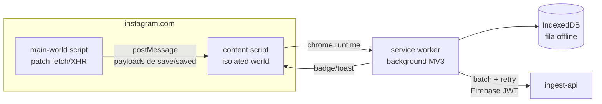

# 02 — Estratégia de Captura do Instagram

## O problema

A **Instagram Graph API** (contas profissionais) e a **Basic Display API** (descontinuada em dez/2024) **não expõem posts salvos nem coleções**. Não existe endpoint oficial, webhook ou export automatizado para "saved". O "Download Your Information" (DYI/Meta Accounts Center) exporta `saved_posts.json`, mas é manual, assíncrono (horas) e **não inclui a coleção** de cada item de forma confiável.

Portanto, qualquer solução automática opera fora da API oficial. A escolha é sobre **qual estratégia minimiza risco (conta, manutenção, jurídico) e fricção**, não sobre encontrar uma via "oficial" que não existe.

## Comparação das estratégias

| Critério | Extensão Chrome (passiva) | Playwright/Puppeteer (servidor) | Automação agendada (headless + cookies) | Captura manual (share/colar URL) | Export DYI periódico | Apps de terceiros / APIs não-oficiais |
|---|---|---|---|---|---|---|
| **Como funciona** | Roda no navegador do usuário, na sessão real; intercepta respostas GraphQL/DOM quando ele navega e salva posts | Browser automatizado no servidor com credenciais/cookies do usuário | Igual ao anterior, com Cloud Scheduler varrendo /saved | Usuário compartilha URL para uma PWA ou cola no dashboard | Solicita export ZIP da Meta e faz parse | Bibliotecas tipo instagrapi / serviços pagos |
| **Automação** | Alta (zero gesto extra) | Total | Total | Nenhuma (1 gesto por post) | Baixa (mensal, manual) | Total |
| **Captura a coleção?** | ✅ Sim (payload do save contém `collection_id`) | ✅ Sim (navegando cada coleção) | ✅ Sim | ⚠️ Não (usuário escolhe no app) | ⚠️ Parcial/não confiável | ✅ Sim |
| **Risco de bloqueio da conta** | 🟢 Baixo — tráfego é o do próprio usuário, mesmo IP/fingerprint/ritmo humano | 🔴 Alto — datacenter IP, fingerprint de headless, padrões roboticos; Instagram investe pesado em detecção | 🔴 Muito alto — acesso recorrente fora do padrão humano | 🟢 Nenhum | 🟢 Nenhum (fluxo oficial) | 🔴 Alto + risco de vazar credenciais a terceiros |
| **Credenciais fora do dispositivo?** | 🟢 Não — nada de senha/cookie sai do navegador | 🔴 Sim — cookies/senha no servidor (superfície de ataque grave) | 🔴 Sim | 🟢 Não | 🟢 Não | 🔴 Sim |
| **Custo de manutenção** | 🟡 Médio — seletores/endpoints GraphQL mudam a cada ~2–6 meses; corrigível com camada de parsing isolada | 🔴 Alto — mesmas quebras + corrida armamentista anti-bot (captcha, checkpoint, 2FA) | 🔴 Alto | 🟢 Baixo | 🟡 Médio (formato do ZIP muda) | 🔴 Alto e fora do seu controle |
| **Conformidade ToS Meta** | 🟠 Cinza — ToS proíbe "coleta automatizada"; porém é o usuário acessando os próprios dados, no próprio navegador, para uso pessoal (menor gravidade e menor detectabilidade) | 🔴 Violação clara (automated access) | 🔴 Violação clara | 🟢 Conforme | 🟢 Conforme (mecanismo oficial LGPD/GDPR de portabilidade) | 🔴 Violação clara |
| **Vídeo/mídia** | ✅ URLs de CDN capturáveis na hora | ✅ | ✅ | ⚠️ via oEmbed/preview | ✅ inclui mídia | ✅ |
| **Funciona no celular?** | ❌ (desktop/Android+Kiwi apenas) | n/a | n/a | ✅ share sheet nativo | ✅ | ✅ |

## Recomendação: arquitetura híbrida em 3 camadas

### 🥇 Camada 1 (primária): Extensão Chrome MV3 passiva

A extensão **não automatiza nada** — ela **observa** o que o usuário já faz:

1. **Interceptação de saves em tempo real.** Ao clicar em "Salvar" no instagram.com, o cliente web dispara uma mutation GraphQL (`.../save/`, com `collection_id` quando salvo direto numa coleção). A extensão observa essas respostas (via `fetch`/`XMLHttpRequest` patch no `MAIN` world + fallback de `MutationObserver` no DOM) e extrai: shortcode, coleção, caption, autor, tipo, URLs de mídia, hashtags, localização, likes, timestamp.
2. **Sincronização retroativa.** Quando o usuário abre `instagram.com/{user}/saved/`, a extensão lê os payloads JSON que o próprio Instagram carrega ao rolar a página e reconcilia com o Vault (backfill das coleções existentes — importante para os ~anos de conteúdo já salvos). A extensão **nunca navega sozinha**: apenas sugere "abra suas coleções para sincronizar" e captura enquanto o usuário rola.
3. **Fila offline.** Capturas vão para IndexedDB e são enviadas à `ingest-api` com retry — nada se perde se a API estiver fora.
4. **Feedback imediato.** Badge/toast "✅ Salvo no Vault → Vendas" reforça confiança no sistema.

**Por que vence tecnicamente:**
- Tráfego indistinguível do uso normal (mesmo IP, sessão, fingerprint, cadência humana) → risco de conta mínimo.
- `collection_id` vem de graça no momento do save — o dado mais difícil de obter por qualquer outra via.
- Credenciais nunca saem do navegador; o servidor do Vault **nunca** vê senha ou cookie do Instagram.
- Camada de parsing isolada (`packages/ig-parser`) com testes de contrato: quando o Instagram mudar o payload, corrige-se um pacote, não o sistema.

**Limitações aceitas:** só captura com o navegador aberto (mitigado pela sync retroativa) e não cobre mobile (mitigado pela Camada 2).

### 🥈 Camada 2 (fallback mobile): Share-to-Vault (PWA)

No celular (onde a maioria dos saves acontece), o usuário usa o **share sheet nativo**: Compartilhar → "Renan Vault". Uma PWA com Web Share Target (Android) / Atalho (iOS) recebe a URL, pergunta a coleção (pré-sugerida pela IA com base no histórico) e envia à `ingest-api`, que resolve metadados via oEmbed + fetch da página pública. **Um gesto extra**, 100% conforme ToS, zero risco. A sync retroativa da Camada 1 depois reconcilia a coleção real.

### 🥉 Camada 3 (garantia/backfill): Export DYI trimestral

A cada ~3 meses, o usuário solicita o export oficial da Meta e arrasta o ZIP para o dashboard (`/settings/import`). O parser reconcilia qualquer item perdido. É o **mecanismo oficial de portabilidade de dados (LGPD art. 18)** — auditável e à prova de mudanças de frontend.

### Estratégias rejeitadas

- **Playwright/Puppeteer em servidor:** exigiria armazenar a sessão do Instagram no GCP (risco de segurança inaceitável para dados pessoais), IPs de datacenter são flag imediata, e o custo de manutenção da corrida anti-bot é o mais alto de todas as opções. Rejeitado mesmo sendo "mais automático".
- **Automação agendada headless:** todos os problemas acima, amplificados pela regularidade (padrão detectável por definição).
- **APIs não-oficiais/terceiros:** entrega credenciais a código de terceiros; hall de banimentos conhecido. Rejeitado.

## Design da extensão

- **Permissões mínimas:** `host_permissions: ["https://www.instagram.com/*"]`, `storage`, `alarms`. Sem `tabs`, sem `history`.
- **Autenticação:** login Google via `chrome.identity` → token Firebase; refresh silencioso.
- **Privacidade:** a extensão envia apenas metadados de posts salvos — nunca DMs, feed ou dados de navegação.
- **Resiliência a mudanças:** parsing versionado (`parserVersion` gravado em cada post); telemetria de "parse miss" alerta quando o Instagram muda o payload antes de o usuário perceber.

## Riscos residuais e mitigação

| Risco | Prob. | Impacto | Mitigação |
|-------|-------|---------|-----------|
| Instagram muda payload GraphQL | Alta (2–6 meses) | Captura para de funcionar | Parser isolado + testes de contrato + alerta de parse-miss + fallback DOM |
| Meta endurece detecção de extensões | Baixa | Camada 1 morre | Camadas 2 e 3 continuam; arquitetura plugável |
| Conta sinalizada | Muito baixa (passivo) | Checkpoint/verificação | Extensão nunca automatiza ações; rate natural humano |
| Chrome Web Store recusa publicação | Média | Distribuição | Distribuir unpacked/dev mode (uso pessoal) — não precisa da store |
| Mudança de ToS mais restritiva | Baixa | Jurídico | Uso estritamente pessoal, dados próprios, sem redistribuição; Camada 3 é sempre legal |
