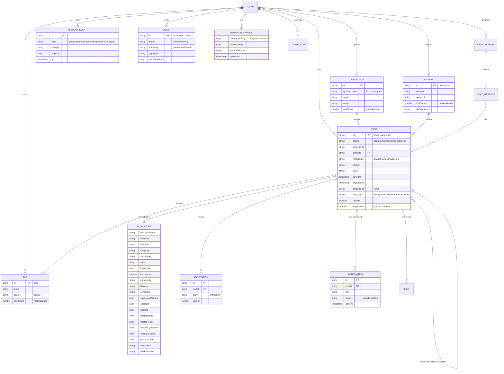

# 03 — Modelo de Dados

## Estratégia geral

- **Firestore Native mode**, tudo escopado sob `users/{uid}` (single-tenant hoje, multi-tenant pronto).
- **Documento de post "gordo"**: o post carrega denormalizações (nome do autor, nome da coleção, análise de IA embutida) para que a Biblioteca renderize com **1 leitura por card**. Firestore cobra por leitura — denormalizar é a otimização de custo nº 1.
- **Agregados materializados** (`stats/`): contadores atualizados transacionalmente no pipeline, nunca `COUNT()` em tempo de página.
- **Embeddings no próprio doc do post** (campo `Vector` de 768d) + **índice vetorial** do Firestore para `findNearest`.
- **Histórico como event log** (`history/`): toda mutação relevante vira evento imutável → alimenta Analytics (tempo até implementação, taxa de implementação) e auditoria LGPD.

## Diagrama entidade-relacionamento



## Estrutura de coleções no Firestore

```
users/{uid}
├── profile (doc)                      # nome, email, preferências, onboarding
├── behaviorProfile (doc)              # afinidades aprendidas (IA)
│
├── posts/{shortcode}                  # ★ entidade central
├── collections/{collectionId}         # espelho das coleções do IG + virtuais
├── tags/{tagSlug}
├── authors/{username}
│
├── posts/{shortcode}/annotations/{annotationId}
├── posts/{shortcode}/annotations/{id}/versions/{n}   # versionamento
├── posts/{shortcode}/actions/{actionId}              # checklist
│
├── chats/{sessionId}
│   └── messages/{messageId}           # role, content, citedPostIds[]
│
├── history/{eventId}                  # event log imutável
├── digests/{periodId}                 # resumos semanais/mensais
├── stats/{statId}                     # agregados: byCategory, byMonth, byAuthor, funnel
└── searchLog/{queryId}                # queries p/ aprendizado de comportamento
```

### Documento `posts/{shortcode}` (completo)

```jsonc
{
  // ---- Identidade e captura ----
  "id": "DAbC123xyz",                          // shortcode IG (dedupe natural)
  "igUrl": "https://www.instagram.com/p/DAbC123xyz/",
  "source": "extension",                       // extension | share | manual | dyi_import
  "parserVersion": "2026.07.1",
  "status": "indexed",                         // captured|media_stored|enriched|indexed|failed
  "capturedAt": "<ts>", "savedAt": "<ts>", "postedAt": "<ts>",

  // ---- Metadados do Instagram ----
  "mediaType": "reel",                         // image|video|carousel|reel
  "caption": "…texto original…",
  "hashtags": ["#vendas", "#negociacao"],
  "location": { "name": "São Paulo", "lat": -23.55, "lng": -46.63 },
  "likeCount": 15234, "commentCount": 210,     // snapshot no momento da captura

  // ---- Denormalizações (1 leitura por card) ----
  "author": { "id": "ig_username", "fullName": "Fulano", "avatarPath": "gs://…" },
  "collection": { "id": "17851...", "name": "Vendas", "emoji": "💼" },

  // ---- Mídia própria (GCS) ----
  "media": {
    "coverPath": "users/{uid}/posts/DAbC/cover.jpg",
    "thumbPath": "users/{uid}/posts/DAbC/thumb.webp",
    "videoPath": "users/{uid}/posts/DAbC/video.mp4",   // null se não capturável
    "videoDurationS": 42
  },

  // ---- Enriquecimento IA (AI_ANALYSIS embutida) ----
  "ai": {
    "execSummary": "…", "oneLiner": "…",
    "keyIdeas": ["…"], 
    "category": "Vendas", "subcategory": "Negociação",
    "tags": ["spin-selling", "objecoes"], "keywords": ["ancoragem", "rapport"],
    "importance": 4, "complexity": "intermediate",
    "lifeArea": "professional",                // professional|personal|health|relationships|spiritual|leisure
    "sentiment": "inspirational",
    "suggestedActions": ["…"],
    "checklist": [{ "text": "…", "done": false }],
    "insights": ["…"], "relatedBooks": ["SPIN Selling — Neil Rackham"],
    "relatedTopics": ["persuasão"], 
    "answersQuestions": ["Como contornar objeção de preço?"],
    "openQuestions": ["…"], "practicalUses": ["…"],
    "whyUseful": "…",
    "model": "gemini-2.5-flash", "promptVersion": "enrich_v3", "enrichedAt": "<ts>"
  },

  // ---- Busca semântica ----
  "embedding": Vector(768),                    // caption + ai.execSummary + keyIdeas
  "embeddingModel": "gemini-embedding-001",

  // ---- Estado do usuário ----
  "lifecycle": "to_test",                      // inbox | to_test | implemented | archived
  "lifecycleChangedAt": "<ts>",
  "favorite": true,
  "userImportance": 5,                         // override do usuário sobre ai.importance
  "userTags": ["curso-equipe"],
  "hasAnnotations": true,
  "openActionCount": 2,

  // ---- Relacionamentos (denormalizado, top-N por similaridade) ----
  "related": [{ "postId": "XyZ", "score": 0.91, "reason": "mesmo tema: ancoragem" }]
}
```

### Documento `stats/` (agregados materializados)

```jsonc
// stats/overview
{ "totalPosts": 1830, "byLifecycle": { "inbox": 1500, "to_test": 200, "implemented": 90, "archived": 40 },
  "implementationRate": 0.049, "avgDaysToImplement": 18.5, "favoriteCount": 120 }

// stats/byCategory   → { "Vendas": 320, "IA": 280, "Restaurantes": 190, … }
// stats/byMonth      → { "2026-07": { "saved": 42, "implemented": 3 }, … }
// stats/byAuthor     → top 50 autores com contagem
// stats/heatmap      → { "2026-07-08": 5, … }  (mapa de calor de saves por dia)
```

## Índices

### Índice vetorial (gcloud)

```bash
gcloud firestore indexes composite create \
  --collection-group=posts \
  --query-scope=COLLECTION \
  --field-config=vector-config='{"dimension":768,"flat": {}}',field-path=embedding
```

### Índices compostos principais

| Coleção | Campos | Sustenta |
|---------|--------|----------|
| posts | `status ASC, savedAt DESC` | Biblioteca (recentes) |
| posts | `collection.id ASC, savedAt DESC` | Filtro por coleção |
| posts | `ai.category ASC, ai.importance DESC` | Filtro categoria + importância |
| posts | `lifecycle ASC, savedAt DESC` | "ainda não implementados" |
| posts | `favorite ASC, savedAt DESC` | Favoritos |
| posts | `author.id ASC, savedAt DESC` | Página do autor |
| history | `type ASC, at DESC` | Analytics de funil |

### Busca combinada (vetorial + filtro)

`findNearest` do Firestore aceita `where()` pré-filtro. Ex.: *"restaurantes românticos"* → `where('ai.category','==','Restaurantes')` + `findNearest('embedding', qVec, {limit: 20, distanceMeasure: 'COSINE'})`.

## Full-text e pesquisa instantânea

- **MVP:** busca instantânea client-side com **MiniSearch** sobre um índice leve (id, oneLiner, tags, autor, categoria — ~100 bytes/post) carregado via React Query e atualizado incrementalmente. 5k posts ≈ 500 KB — instantâneo (< 10 ms por keystroke), custo zero.
- **Semântica:** query → embedding → `findNearest` (rag-service), acionada com debounce ou Enter ("busca profunda").
- **V3:** se a base passar de ~50k itens, promover para **Typesense/Meilisearch em Cloud Run** ou Vertex AI Search.

## Retenção e versionamento

- `annotations` versionadas em subcoleção `versions/{n}` (máx. 50 versões, LRU).
- `history/` é append-only; TTL policy do Firestore em `searchLog` (180 dias) para higiene LGPD.
- Post deletado → soft-delete (`deletedAt`) por 30 dias → purge job (Scheduler) remove doc + mídia GCS.
