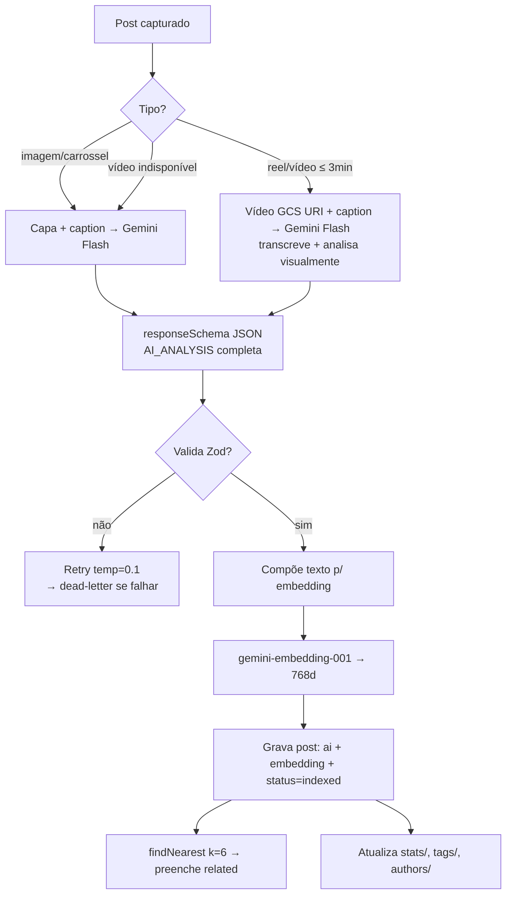

# 05 — Estratégia de IA, Embeddings e Busca Vetorial

## 1. Modelos e responsabilidades

| Tarefa | Modelo | Por quê |
|--------|--------|---------|
| Enriquecimento estruturado (20+ campos) | **Gemini 2.5 Flash** | Extração estruturada não exige raciocínio profundo; Flash entrega ~95% da qualidade a ~1/10 do custo do Pro; multimodal (analisa a imagem de capa junto) |
| Análise de vídeo/reel (transcrição + visão) | **Gemini 2.5 Flash** (input de vídeo nativo) | Reels são a maioria dos saves; o áudio costuma ter mais conteúdo que a legenda |
| Chat RAG, planos, roteiros | **Gemini 2.5 Pro** | Síntese sobre 20–50 documentos exige contexto longo e raciocínio |
| Resumo semanal/mensal | Gemini 2.5 Flash | Volume baixo, tarefa formulaica |
| Embeddings | **gemini-embedding-001** (768d via `output_dimensionality`) | Estado da arte multilíngue (PT-BR!), Matryoshka permite truncar para 768d |

Tudo via **Vertex AI** (não AI Studio): service account + IAM, quotas de produção, VPC-SC possível na versão Enterprise, logging integrado.

## 2. Pipeline de enriquecimento



### Prompt de enriquecimento (estrutura, `packages/ai/prompts/enrich_v3.ts`)

```
SYSTEM: Você é o analista de conhecimento pessoal do Renan. Ele salva posts do
Instagram para transformá-los em conhecimento acionável. Contexto do usuário:
executivo de vendas/gestão, interesses: {top categorias do behaviorProfile}.
Coleção onde ele salvou: "{collection.name}" — use-a como sinal forte de intenção.
Responda SEMPRE no schema JSON fornecido, em português.

USER: [capa ou vídeo] + caption + autor + hashtags + localização
```

- **Saída forçada por `responseSchema`** (JSON Schema espelhando `AiAnalysis` do `packages/shared`) — sem parsing frágil.
- **Categoria**: enum fechado com as categorias do usuário (Vendas, Liderança, IA, Restaurantes…) + `Outros`; subcategoria livre. A IA pode **sugerir** nova categoria em campo separado (`suggestedNewCategory`) — o usuário aprova no dashboard.
- **Campos de intenção** (`answersQuestions`, `openQuestions`, `practicalUses`, `whyUseful`) são escritos **na voz do usuário** ("Como eu posso…") — melhora muito o recall da busca semântica, porque as perguntas do usuário batem com perguntas indexadas.
- **Versionamento de prompt** (`promptVersion` gravado no post) permite reprocessamento seletivo quando o prompt evoluir.

### Texto do embedding (documento sintético)

Não se embeda a caption crua. Embeda-se um documento composto que maximiza recall:

```
{ai.oneLiner}
Categoria: {category} / {subcategory}. Coleção: {collection.name}.
{ai.execSummary}
Ideias: {keyIdeas.join(' · ')}
Tags: {tags} {keywords}
Responde: {answersQuestions.join(' ')}
Local: {location.name}   Autor: @{author}
```

`task_type=RETRIEVAL_DOCUMENT` na indexação; `task_type=RETRIEVAL_QUERY` nas buscas (assimetria melhora o ranking).

## 3. Busca vetorial

### MVP–V2: Firestore Vector Search nativo

- Índice `flat` (KNN exato) sobre `posts.embedding`, `COSINE`.
- **Pré-filtro estruturado + KNN**: `where(category==X) → findNearest(k)` resolve "restaurantes românticos" e "IA que ainda não implementei".
- Exato (não aproximado) → recall perfeito; para < 100k docs a latência é dezenas de ms.

### Roteamento de query (rag-service)

```mermaid
flowchart LR
    Q[Query do usuário] --> INT{Gemini Flash-Lite<br/>intent router}
    INT -->|estruturada<br/>"favoritos de julho"| SQ[Query Firestore direta]
    INT -->|semântica<br/>"negociação"| VS[embedding → findNearest k=30]
    INT -->|híbrida<br/>"restaurantes românticos"| HY[filtro categoria + findNearest]
    VS & HY --> RR[Rerank: score vetorial<br/>+ recência + importância + afinidade]
    SQ & RR --> RES[Resultados + facetas]
```

### V3: migração para Vertex AI Vector Search

Gatilhos: > 500k posts, p95 > 300 ms, ou necessidade de ANN + filtros complexos. A migração é um job que re-exporta embeddings existentes — o modelo de dados não muda (ADR-002).

## 4. Chat com a biblioteca (RAG)

1. **Retrieve**: intent router → 20–40 candidatos (vetorial + filtros).
2. **Augment**: para cada candidato, injeta o **cartão compacto** (oneLiner, execSummary, tags, categoria, lifecycle, url) — não o post inteiro; ~150 tokens/post mantém o contexto barato.
3. **Generate**: Gemini 2.5 Pro com instrução *"responda APENAS com base nos posts fornecidos; cite [postId] em cada afirmação; se não houver material, diga o que falta"*.
4. **Cite**: frontend transforma `[postId]` em cards clicáveis.

Casos suportados por *tools* (function calling) no chat:
- `search_library(query, filters)` — busca adicional multi-hop ("compare o que salvei sobre SPIN e sobre Challenger").
- `create_plan(postIds, goal)` — roteiro de viagem, treinamento de vendas, plano de leitura.
- `update_lifecycle(postId, state)` — "marca esses três como quero testar".

## 5. Aprendizado de comportamento (personalização)

Fonte: `history/` + `searchLog/` → job noturno (`/tasks/behavior`) atualiza `behaviorProfile`:

```jsonc
{
  "categoryAffinity": { "Vendas": 0.92, "Restaurantes": 0.81, "IA": 0.78 },
  "authorAffinity":   { "fulano": 0.9 },
  "temporalPatterns": { "restaurantes": "sexta", "vendas": "seg-qua" },
  "implementBias":    { "Vendas": 0.15, "IA": 0.02 }   // taxa de implementação por categoria
}
```

Usos concretos:
- **Ranking**: afinidade entra no rerank da busca e da Home ("mais importantes para você").
- **Sugestão de coleção** no share-to-vault (classificação Flash-Lite + prior de afinidade).
- **Nudges no digest semanal**: "Você salvou 12 posts de IA este mês e implementou 0 — quer que eu monte um plano com os 3 mais práticos?"
- **Recomendação de revisita** (spaced repetition): posts importantes não abertos há N dias reaparecem na Home.

Privacidade: o perfil é derivado apenas dos dados do próprio usuário, armazenado no escopo dele, apagável (LGPD) e explicável (cada recomendação mostra o "porquê").

## 6. Custos e resiliência de IA

- **Batch API do Vertex** (50% de desconto) para reprocessamentos em massa e backfill do histórico.
- **Context caching** no chat para o system prompt + cartões da sessão.
- **Orçamento**: alerta de billing por serviço (label `service=enrichment`) — ver Doc 07.
- **Fallback de modelo**: se Flash exceder cota → fila segura o post (Cloud Tasks rate limit), nunca degrada para resposta sem schema.
- **Avaliação**: conjunto dourado de 50 posts com análise revisada; toda mudança de prompt roda o eval (script `packages/ai/eval`) e compara aderência de categoria/tags antes do deploy.
