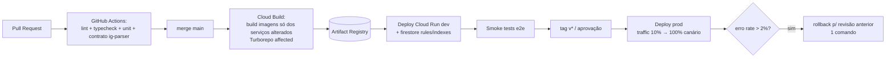

# 07 — Deploy, Observabilidade, Custos, Escalabilidade e Testes

## 1. Estratégia de deploy

### Ambientes

| Ambiente | Projeto GCP | Deploy | Uso |
|---|---|---|---|
| `dev` | `renan-vault-dev` | automático em merge na `main` | validação contínua |
| `prod` | `renan-vault-prod` | promoção manual (tag `v*`) ou aprovação no GitHub | uso real |

Emuladores Firebase (Firestore/Auth/Storage) para desenvolvimento local — custo zero e testes rápidos.

### Pipeline CI/CD (GitHub Actions + Cloud Build)

- **Workload Identity Federation** GitHub↔GCP (sem chaves JSON).
- Cloud Run: revisões imutáveis, canário por divisão de tráfego, rollback instantâneo.
- Infra por **Terraform** (`infra/terraform`): filas, buckets, índices, alertas, IAM — nada clicado no console.
- Extensão: build + zip versionado como artifact do release (instalação unpacked; store opcional depois).

### Configuração Cloud Run (custo-consciente)

| Serviço | CPU/Mem | min/max instances | Concurrency |
|---|---|---|---|
| web (Next.js) | 1 / 512Mi | 0 / 3 | 80 |
| ingest-api | 1 / 512Mi | 0 / 5 | 80 |
| enrichment | 1 / 1Gi | 0 / 3 | 4 (Gemini-bound) |
| rag | 1 / 1Gi | 0 / 3 | 20 |
| digest | 1 / 512Mi | 0 / 1 | 1 |

`min=0` em tudo: cold start de ~1–2 s é aceitável para uso pessoal; V2 pode fixar `min=1` no web/rag se incomodar (+ ~US$ 10/mês cada).

## 2. Observabilidade

### Três pilares

- **Logs:** Cloud Logging estruturado; `traceId` propagado da extensão → ingest → task → enrichment (correlação ponta a ponta de cada post).
- **Métricas:** Cloud Monitoring — padrão do Cloud Run (latência, 5xx, instâncias) + **métricas custom**:
  - `vault/pipeline_duration` (captura→indexed, alvo < 60 s)
  - `vault/enrichment_failures`, `vault/parse_miss` (⚠️ Instagram mudou payload)
  - `vault/gemini_tokens{service}` e `vault/gemini_cost_usd` (custo em tempo real)
  - `vault/search_latency_p95`
- **Traces:** Cloud Trace com OpenTelemetry nos serviços (span por etapa do pipeline: mídia, gemini, embedding, firestore).

### Alertas (→ e-mail + push)

| Alerta | Condição |
|---|---|
| Pipeline quebrado | dead-letter > 0 em 1 h |
| Instagram mudou | `parse_miss` > 3 em 24 h |
| Custo | billing > US$ 1/dia OU projeção mensal > US$ 30 |
| Latência | busca p95 > 800 ms por 15 min |
| Segurança | tentativas de login fora da allowlist |

### SLOs

- Disponibilidade dashboard 99,5% (janela 30 d) · Busca p95 < 500 ms · Pipeline < 60 s p90 · Zero perda de captura (fila offline).

Dashboard único no Cloud Monitoring ("Vault Ops") com tudo acima + página `/settings/system` no app mostrando saúde do pipeline ao usuário.

## 3. Custos estimados (GCP, região SP, 1 usuário)

Premissas: 2.000 posts de histórico (backfill único) + ~300 novos posts/mês; 50 buscas/dia; 30 min de chat/dia.

| Serviço | Uso mensal | Custo/mês (US$) |
|---|---|---|
| Gemini 2.5 Flash (enriquecimento) | 300 posts × ~8k tokens in (vídeo) / 2k out | 2,00–4,00 |
| Gemini 2.5 Pro (chat RAG) | ~600k in / 60k out | 2,50–4,00 |
| gemini-embedding-001 | 300 docs + queries | < 0,20 |
| Cloud Run (todos, min=0) | dentro/perto do free tier | 0–3,00 |
| Firestore | ~150k reads, 30k writes, 2 GB | 0,10–0,50 |
| Cloud Storage (mídia) | 15 GB + 5 GB novos/mês | 0,40–0,80 |
| Cloud Tasks / Scheduler / Secret Manager | mínimo | ~0,10 |
| Logging/Monitoring | < 10 GiB (free tier) | 0,00 |
| Backup (exports GCS) | 5 GB nearline | 0,05 |
| **Total recorrente** | | **≈ 5–13** |
| Backfill único (2.000 posts, Batch API −50%) | one-off | ≈ 8–15 |

Guard-rails: budget GCP US$ 25 com alertas em 50/80/100%; métrica `gemini_cost_usd` por serviço; Batch API para reprocessamentos.

## 4. Escalabilidade

**Hoje (1 usuário):** tudo serverless escala a zero; Firestore aguenta ordens de magnitude acima do uso.

**Gargalos previstos e plano:**

| Dimensão | Limite confortável atual | Próximo passo (gatilho) |
|---|---|---|
| Busca vetorial (KNN flat) | ~500k posts / p95 300 ms | Vertex AI Vector Search (V3) |
| Busca instantânea client-side | ~50k posts | Typesense/Meilisearch no Cloud Run |
| Enriquecimento | cota Gemini (rate limit da fila protege) | subir quota + paralelizar filas |
| Multiusuário (Enterprise) | modelagem já é multi-tenant | App Check, quotas por uid, billing por tenant, CMEK |
| Hot-spots Firestore | escrita ~1/s | irrelevante neste domínio |

## 5. Plano de testes

| Camada | Ferramenta | O que cobre | Gate |
|---|---|---|---|
| Unit (packages/services) | Vitest | ig-parser (fixtures reais versionadas ★), schemas Zod, rerank, prompts render | PR |
| Contrato | Vitest + fixtures | payloads IG antigos **e** atuais → parser nunca regride; DTOs API ↔ shared | PR |
| Integração | Vitest + Firebase Emulators | ingest → task → enrichment (Gemini mockado) → Firestore; Security Rules (`@firebase/rules-unit-testing`) | PR |
| IA (eval) | script `packages/ai/eval` | 50 posts dourados: aderência de categoria ≥ 90%, tags F1, schema válido 100% | mudança de prompt/modelo |
| E2E | Playwright | login → biblioteca → busca → abrir post → lifecycle → chat com citação | deploy dev |
| Extensão E2E | Playwright + Chrome com extensão | página IG **gravada** (HAR replay — sem tocar o IG real no CI) → captura → payload correto | PR da extensão |
| Carga (leve) | k6 | busca 20 rps, chat 5 rps — valida SLO | antes de release major |
| Smoke prod | GitHub Action pós-deploy | health checks + 1 busca sintética | cada deploy |

**Regra:** nenhum teste de CI toca o Instagram real — tudo via fixtures/HAR gravados manualmente quando o parser é atualizado.

## 6. Runbooks (em `infra/runbooks/`)

- `parse-miss.md` — Instagram mudou: como gravar novo fixture, atualizar parser, reprocessar dead-letter.
- `restore.md` — restaurar Firestore de export/PITR (testado trimestralmente).
- `cost-spike.md` — identificar serviço, pausar fila, reduzir modelo.
- `stuck-pipeline.md` — drenar dead-letter, reprocessar por intervalo de datas.
